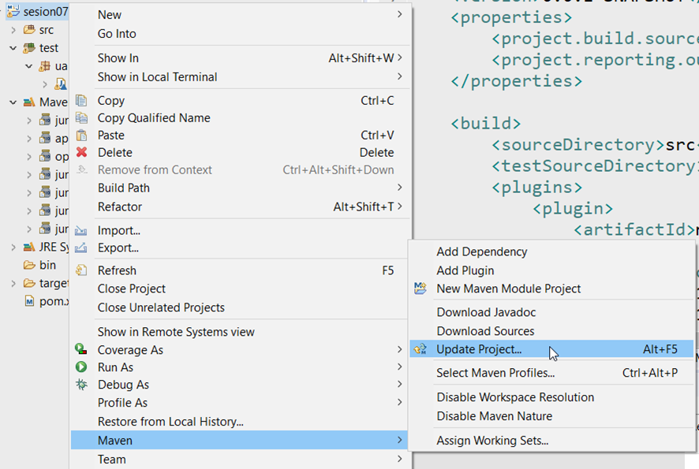

////
Codificación, idioma, tabla de contenidos, tipo de documento
////
:encoding: utf-8
:lang: es
:toc: right
:toc-title: Tabla de contenidos
:keywords: Maven HMIS
:doctype: book
:icons: font

////
/// activar btn:
////
:experimental:

////
///  Copy button on code blocks
////
[.doc]

:docinfo: shared-footer

////
Nombre y título del trabajo
////
= Maven
Herramientas y Métodos de Ingeniería del Software
Version 2.0, Marzo-2023
Joaquín Cañadas <jjcanada@ual.es>

// Entrar en modo no numerado de apartados
:numbered!: 

[abstract]
////
COLOCA A CONTINUACIÓN EL RESUMEN
////

Maven

////
COLOCA A CONTINUACIÓN LOS OBJETIVOS
////
.Objetivos
* 
* 

# Prerrequisitos

El guion de esta actividad está actualizado para JUnit5. Para cada proyecto de la actividad 05 - Pruebas Unitarias en JUnit.

## Configuración del UTF-8 en el IDE

image:images/eclipse_2.png[Eclipse] Si estás usando Eclipse, no olvides configurar Eclipse para que utilice UTF-8 como codificación predeterminada: _Window > Preferencies > General > Workspace > Text file encoding > Other > UTF-8_

image::images/eclipse-utf8.png[Eclipse utf8]

image:images/Visual_Studio_Code_icon.png[VSCode] Si usas VS Code para desarrollar en Java: 

. Instala las extensiones Java, Maven, Java Debugger

. Si no configuras el UTF-8 en el IDE, los tests de caracteres con acentos o con eñes fallarán. Configurar UTF-8 en la compilación y depuración con Java: Extensions / Java Debugger

image::images/vscode-java-utf8.png[vscode-java-utf8]

Esto se traduce en el archivo de `settings.json` del usuario en:

[source,json]
----
   "java.debug.settings.vmArgs": "-Dfile.encoding=UTF-8"
----

# Pasos a seguir

// Entrar en modo numerado de apartados
:numbered:

## Convertir a proyecto Maven

image:images/eclipse_2.png[Eclipse] Si en la actividad 5 habías partido del proyecto en GitHub, como ualhmis/junitEjercicios o ualhmis/hmis-coches, este paso y los dos siguientes ya están hechos. Simplemente debes comprobar que ya lo habíamos hecho en la actividad 5. Si, por el contrario, tu(s) proyecto(s) de la actividad 5 no están mavenizados, hazlo ahora:

Sobre el proyecto, botón derecho, _Configure_, _Convert to maven project_

image::images/convert-to-maven-project.png[convert-to-maven-project]

Verás que se ha creado un nuevo archivo llamado `pom.xml` que es el que contiene la configuración de Maven para el proyecto.

image:images/Visual_Studio_Code_icon.png[VSCode] Si usas VS Code para desarrollar en Java, haz lo siguiente:

. Crea un archivo `pom.xml` en la raíz del proyecto, con el siguiente contenido básico:

[source,xml]
----
<project xmlns="http://maven.apache.org/POM/4.0.0" xmlns:xsi="http://www.w3.org/2001/XMLSchema-instance" xsi:schemaLocation="http://maven.apache.org/POM/4.0.0 https://maven.apache.org/xsd/maven-4.0.0.xsd">
	<modelVersion>4.0.0</modelVersion>
	<groupId>hmis-coches</groupId>
	<artifactId>hmis-coches</artifactId>
	<version>0.0.1-SNAPSHOT</version>
    <build>
    	<plugins>
			<plugin>
				<artifactId>maven-compiler-plugin</artifactId>
				<version>3.11.0</version>
				<configuration>
					<release>11</release>
				</configuration>
			</plugin>
        </plugins>
    </build>
</project>
----

El contenido mínimo del `pom.xml` es:

* project root
* modelVersion - debe ser `4.0.0`
* groupId - identificador del grupo del proyecto.
* artifactId - identificador de artefacto (proyecto)
* version - version del artefacto bajo el grupo especificado

Los parámetros `groupId`, `artifactId`, y `version` forma el nombre completo de artefacto del proyecto (project's fully qualified artifact name). Este nombre tiene la forma <groupId>:<artifactId>:<version>. En el ejemplo anterior, sería "`hmis-coches.hmis-coches:0.0.1-SNAPSHOT`".

* build - contiene la configuración de compilación del proyecto, y los plugins que se ejecutan durante la construcción del proyecto. En el ejemplo anterior, se configura el plugin `maven-compiler-plugin` para que compile con Java 11.

## Configurar el archivo `pom.xml`

Configurar el proyecto con codificación UTF-8, y las carpetas donde están los fuentes y los tests:

[source,xml]
----
<properties>
  <project.build.sourceEncoding>UTF-8</project.build.sourceEncoding>
  <project.reporting.outputEncoding>UTF-8</project.reporting.outputEncoding>
</properties>

<build>
  <sourceDirectory>src</sourceDirectory>
  <testSourceDirectory>test</testSourceDirectory>
   ...
</build>
----

## Añadir las dependencias a JUnit5

Añadir las dependencias a JUnit 5 (simplemente comprobar, ya lo habíamos hecho en la actividad 5):

[source,xml]
----
	<dependency>
		<groupId>org.junit.jupiter</groupId>
		<artifactId>junit-jupiter-engine</artifactId>
		<version>5.9.2</version> <1>
		<scope>test</scope>
	</dependency>
	<dependency>
		<groupId>org.junit.jupiter</groupId>
		<artifactId>junit-jupiter-api</artifactId>
		<version>5.9.2</version>
		<scope>test</scope>
	</dependency>
   	<dependency>
		<groupId>org.junit.jupiter</groupId>
		<artifactId>junit-jupiter-params</artifactId>
		<version>5.9.2</version>
		<scope>test</scope>
	</dependency>
----
<1> La versión de JUnit5 que usamos en el momento de escribir este documento es la `5.9.2`, pero debes comprobar la última versión en https://mvnrepository.com/artifact/org.junit.jupiter/junit-jupiter-api y usarla en tu `pom.xml`, en las tres dependencias de JUnit5.

image:images/eclipse_2.png[Eclipse] En Eclipse, hay que eliminar JUnit del ClassPath del proyecto Eclipse 

[WARNING]
====
En *Eclipse*, si en el proyecto aparecen errores de compilación tras añadir las dependencias a Junit en Maven, se debe *actualizar el proyecto*: sobre el proyecto, botón derecho, _Maven, Update Project_.

====

## Lanzar los test desde Maven

Vamos a utilizar el ciclo de vida de  Maven (https://maven.apache.org/guides/introduction/introduction-to-the-lifecycle.html[Maven lifecycle]) para compilar/test/empaquetar el proyecto: 

image:images/eclipse_2.png[Eclipse] Normalmente hasta ahora siempre hemos ejecutado los tests de JUnit desde *Eclipse*, con la opción _Run As… JUnit test_. Ahora vamos a lanzar los test desde *Maven*: _Sobre el proyecto, Botón derecho, Run as… , Maven build_. En el campo Goals: `clean package`

image::images/maven-build-clean-package.png[maven-build-clean-package]

image:images/Visual_Studio_Code_icon.png[VSCode] En VS Code, para lanzar los test desde Maven, desde el terminal ejecuta: 

[source,bash]
----
mvn clean package
----

WARNING: Recuerda que para ejecutar los test con Maven desde el terminal, debes tener instalado Maven en tu sistema operativo. Comprueba que lo tienes instalado con el comando `mvn -v`. Si no lo tienes instalado, puedes descargarlo desde https://maven.apache.org/download.cgi, aunque la instalación recomendada en Windows es con Chocolatey: https://chocolatey.org/packages/maven

[WARNING]
====
Si maven no compila, da error: del tipo `--release` en maven (el `pom.xml` tiene release 11):

- check your JAVA_HOME environment variable.
- I was setting the value of release to 11 as I am using JAVA 11.
- My System JAVA_HOME was set for java 8.
- After changing the JAVA_HOME user environment variable to the java 11 path, this got resolved.
====

## Añadir el plugin de Surefire

##

##

##
## Referencias

